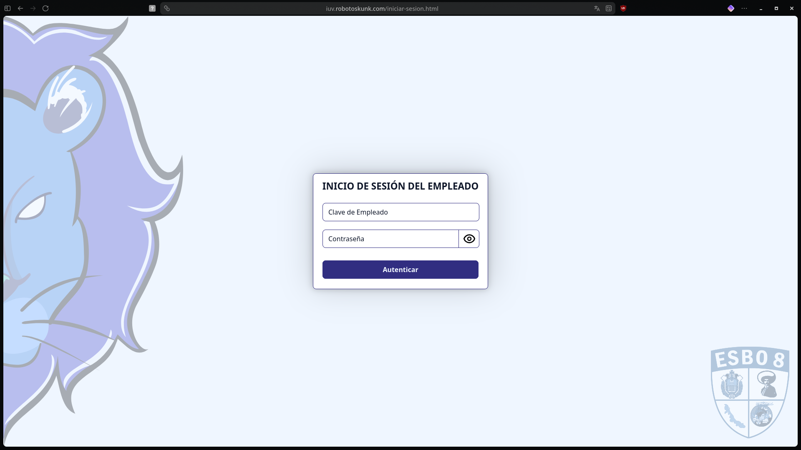
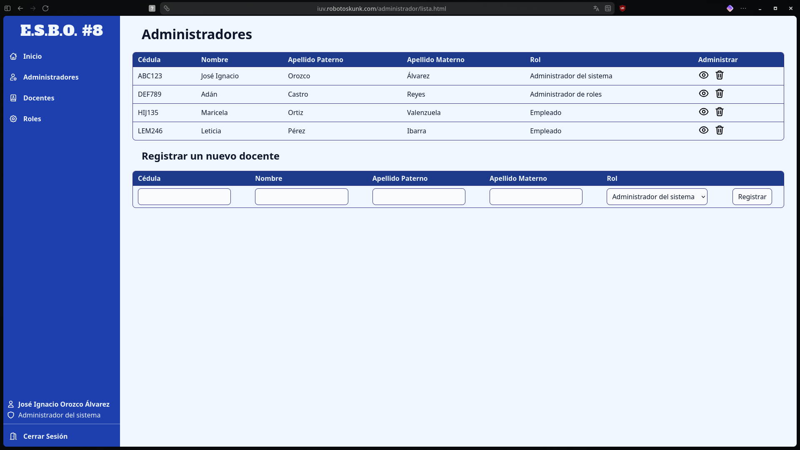
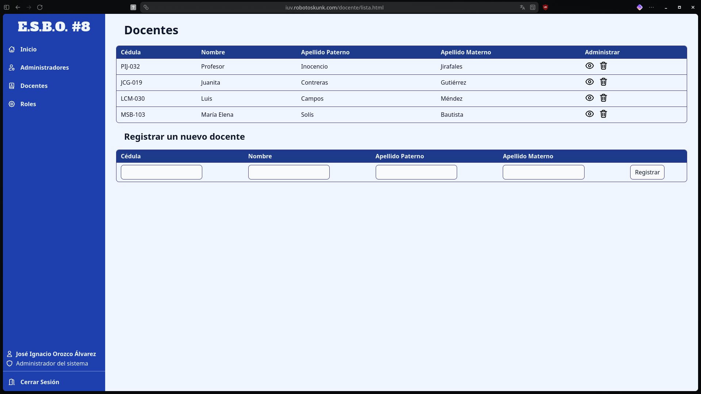
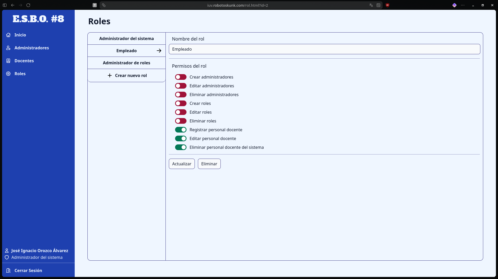
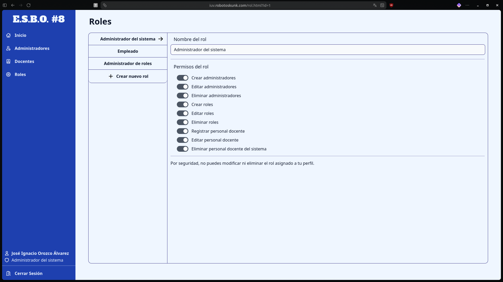
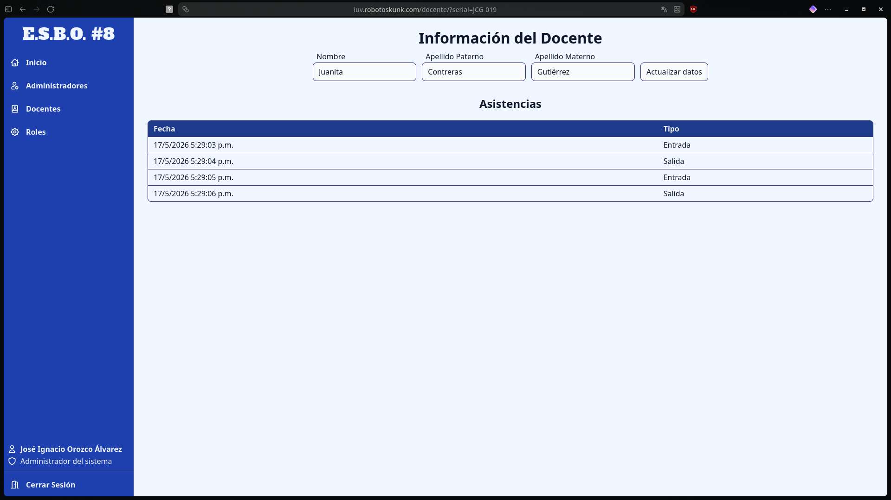
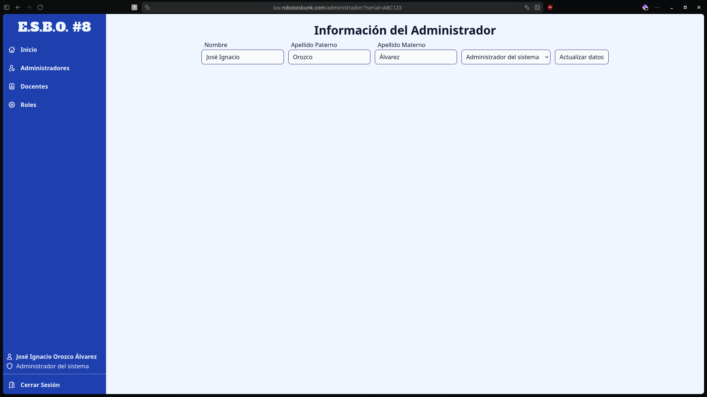

# Sistema de chequeo de entradas y salidas para personal docente (versión estática)

Esta es la versión estática del proyecto original
(https://github.com/RobotoSkunk/iuv-exercise), la cual se conforma únicamente de
archivos HTML, CSS y JavaScript sin frameworks ni APIs funcionales, además de
un backend basado en Bun, TypeScript y PostgreSQL.

Para el funcionamiento de las solicitudes por fetch y la demostración de los
conocimientos sobre JavaScript, los datos consultados son información estática
generada de las solicitudesf fetch del proyecto original con ligeras
modificaciones.

## Ejecución

Primero se debe clonar el archivo `.env.example` a `.env` y configurar sus
valores con los correspondientes, al igual que crear una base de datos y
escribir su nombre en el archivo `.env`.

Posteriormente, solo se debe ejecutar el siguiente comando en el directorio raíz
del proyecto:

```shell
bun run start
```

## Demostración funcional

Para una demostración funcional, la página se encuentra hosteada en
[iuv.robotoskunk.com](https://iuv.robotoskunk.com/).

## Capturas de pantalla

> **Inicio de sesión**
> 

> **Lista de administradores**
> 

> **Lista de docentes**
> 

> **Lista y panel de roles**
> 

> **Panel del rol actual del usuario administrador**
> 

> **Panel de información del docente**
> 

> **Panel de información del administrador**
> 

